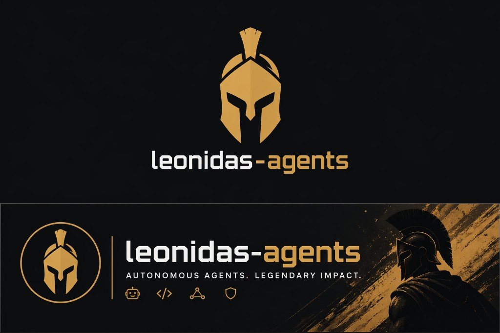
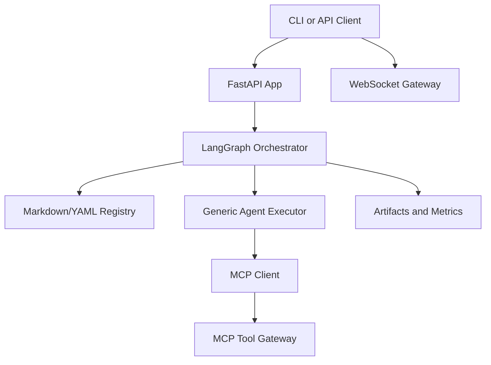

<p align="center">
  
</p>

# Leonidas Agents

Markdown-first, OpenClaw-informed, LangGraph-powered starter kit for building multi-agent systems and apps.

## About

`leonidas-agents` is an open-source Python framework designed as a contributor-friendly base for agentic applications.  
Core objective: **add new agent capabilities by writing Markdown definitions, not by rewiring framework internals**.

This project focuses on:
- rapid contributor onboarding (install to first run in under 10 minutes),
- durable architecture foundations (stateful orchestration, gateway, persistence boundaries),
- thesis-grade reproducibility (metrics and benchmark hooks).

## Why This Project (Moat)

- **Markdown-native extensibility**: contributors add agents via `docs/registry/agents/*.md`.
- **Operational pattern ready**: OpenClaw-inspired gateway touchpoints + heartbeat model.
- **LangGraph-native orchestration**: typed state, composable workflows, resumable execution.
- **MCP tool boundary**: external integrations are isolated and governable.
- **Research-friendly instrumentation**: run metrics and benchmark utilities for evaluation.

## Architecture



### Key Components

- `backend/app/graph/` — LangGraph orchestration and workflow composition.
- `backend/app/agents/` — reusable agent nodes and generic Markdown agent executor.
- `backend/app/gateway/` — real-time touchpoint gateway (`tick`, heartbeat, run events).
- `backend/app/api/` — REST API (`/run`, registry endpoints, approval flow).
- `mcp_server/` — tool execution gateway and tool registry.
- `docs/registry/` — agent/tool/workflow registries (Markdown + YAML).

## Installation and Quickstart (Under 10 Minutes)

Detailed guide: [docs/quickstart-10-min.md](docs/quickstart-10-min.md)

### 1) Install dependencies

```bash
cd leonidas-agents
pip install -e ".[api,dev]"
```

### 2) Start MCP gateway

```bash
uvicorn mcp_server.main:app --port 8001 --env-file .env.mcp
```

### 3) Run guided onboarding

```bash
python backend/cli.py quickstart
```

### 4) First run

```bash
python backend/cli.py "Explain LangGraph in 3 bullets."
```

### Optional: run API server

```bash
uvicorn app.api.main:app --app-dir backend --reload
```

## Contributor Fast Path

- Add a new agent definition: [docs/add-agent.md](docs/add-agent.md)
- Validate registries: `python backend/cli.py validate`
- List all agents: `python backend/cli.py agents`
- Diagnose local setup: `python backend/cli.py doctor`

## WebSocket Gateway Contract (Touchpoint)

Connect to `ws://<host>/gateway/ws`.  
Server sends `connect.challenge` with a nonce. Client responds:

```json
{"type":"req","id":"1","method":"connect","params":{"nonce":"<same nonce>"}}
```

Server returns `hello` in a `res` frame. Runtime events include `tick`, `heartbeat`, and `run.complete`.

